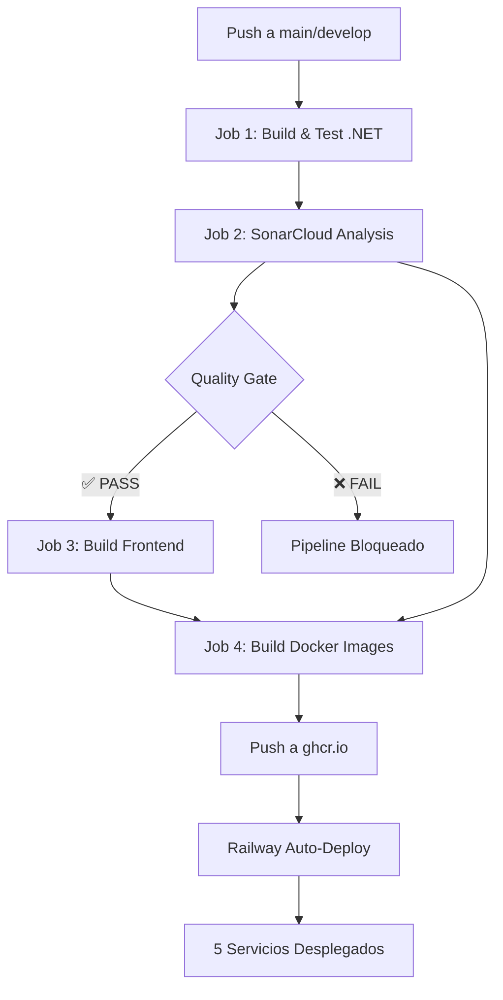
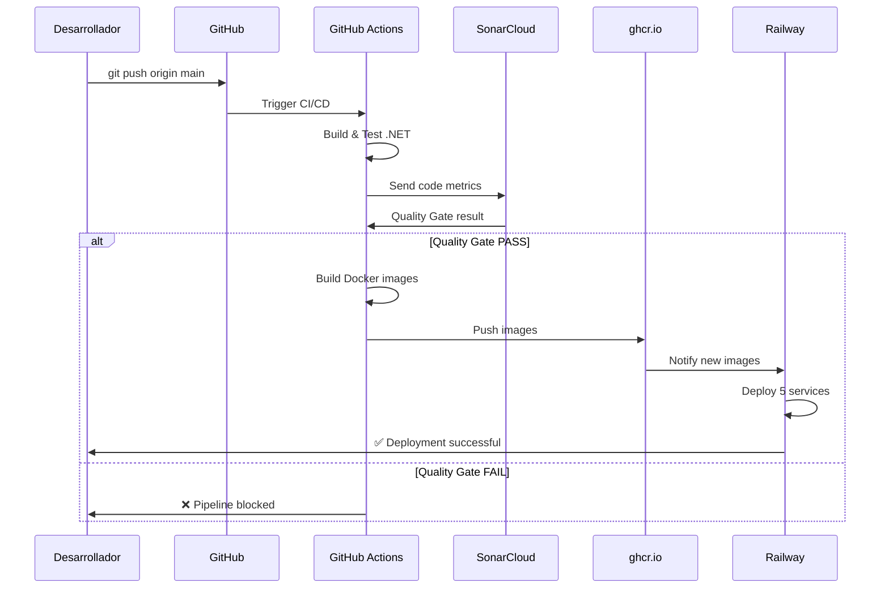

# 🚀 Pipeline CI/CD - Sistema de Gestión Universitaria

## 📋 Tabla de Contenidos

- [Descripción General](#descripción-general)
- [Arquitectura del Pipeline](#arquitectura-del-pipeline)
- [Jobs del Pipeline](#jobs-del-pipeline)
- [Quality Gate](#quality-gate)
- [Configuración Inicial](#configuración-inicial)
- [Despliegue en Railway](#despliegue-en-railway)
- [Flujo de Trabajo](#flujo-de-trabajo)
- [Métricas de Calidad](#métricas-de-calidad)
- [Troubleshooting](#troubleshooting)

---

## 📖 Descripción General

Este proyecto implementa un **pipeline CI/CD completo** que automatiza:

- ✅ **Compilación** de microservicios .NET 9.0
- ✅ **Ejecución de tests** unitarios con cobertura de código
- ✅ **Análisis de calidad** con SonarCloud (Quality Gate)
- ✅ **Construcción de imágenes Docker** para 5 servicios
- ✅ **Publicación** a GitHub Container Registry (ghcr.io)
- ✅ **Despliegue automático** a Railway

### 🏗️ Tecnologías Utilizadas

| Componente | Tecnología |
|------------|------------|
| Backend | .NET 9.0 (4 microservicios) |
| Frontend | Angular 18 + Nginx |
| CI/CD | GitHub Actions |
| Análisis de Código | SonarCloud |
| Containerización | Docker + Docker Buildx |
| Registry | GitHub Container Registry (ghcr.io) |
| Hosting | Railway |
| Base de Datos | PostgreSQL (Neon) |
| Mensajería | RabbitMQ, Kafka |

---

## 🏛️ Arquitectura del Pipeline



---

## 🔧 Jobs del Pipeline

### **Job 1: `build-and-test-dotnet`**

**Objetivo:** Compilar y probar todos los microservicios .NET

**Servicios incluidos:**
- 🔐 `UniversityManagement.AuthService` - Autenticación y autorización
- 🌐 `UniversityManagement.WebApi` - API principal
- 📧 `UniversityManagement.NotificationService` - Notificaciones
- 📊 `UniversityManagement.AuditService` - Auditoría de eventos

**Pasos:**

1. **Checkout del código** (fetch-depth: 0 para análisis completo)
2. **Setup .NET 9.0**
3. **Restore dependencies**
   ```bash
   dotnet restore
   ```
4. **Build en Release**
   ```bash
   dotnet build --no-restore --configuration Release
   ```
5. **Ejecución de Tests**
   ```bash
   dotnet test --logger trx --collect:"XPlat Code Coverage"
   ```
   - Genera reportes `.trx` (resultados)
   - Genera `coverage.cobertura.xml` (cobertura)

6. **Upload de Artefactos:**
   - `dotnet-test-results`: Resultados de tests
   - `coverage-reports`: Reportes de cobertura XML

**Tiempo estimado:** 2-3 minutos

---

### **Job 2: `sonarqube-analysis`** ⭐

**Objetivo:** Análisis de calidad de código con Quality Gate

**Dependencias:** Requiere que Job 1 termine exitosamente

**Configuración de SonarCloud:**

```yaml
Organization: kamaro600
Project Key: kamaro600_net-microservicio-ci-cd
Host: https://sonarcloud.io
```

**Exclusiones configuradas:**

- 📁 Frontend: `**/university-frontend/**`
- 📦 Dependencias: `**/node_modules/**, **/dist/**, **/bin/**, **/obj/**`
- 🧪 Tests: `**Tests**.cs`
- 🔧 Sistema: `**/Program.cs, **/Migrations/**`

**Pasos:**

1. **Setup JDK 17** (requerido por SonarScanner)
2. **Install SonarScanner**
   ```bash
   dotnet tool install --global dotnet-sonarscanner
   ```
3. **Begin Analysis**
   ```bash
   dotnet sonarscanner begin \
     /k:"kamaro600_net-microservicio-ci-cd" \
     /o:"kamaro600" \
     /d:sonar.host.url="https://sonarcloud.io" \
     /d:sonar.token="${SONAR_TOKEN}" \
     /d:sonar.cs.opencover.reportsPaths="**/coverage.cobertura.xml"
   ```
4. **Build para análisis**
5. **End Analysis** (envía métricas a SonarCloud)
6. **Quality Gate Check** (ver sección dedicada)

**Tiempo estimado:** 3-5 minutos

---

### **Job 3: `build-frontend`**

**Objetivo:** Compilar aplicación Angular

**Tecnologías:**
- Node.js 20.x
- Angular 18
- npm ci (instalación limpia)

**Pasos:**

1. **Setup Node.js** con caché de npm
2. **Install dependencies**
   ```bash
   cd university-frontend
   npm ci
   ```
3. **Build producción**
   ```bash
   npm run build --prod
   ```
4. **Upload artefacto:** `frontend-dist`

**Optimizaciones:**
- Caché de `node_modules`
- Build optimizado (`--prod`)
- Tree shaking automático
- Minificación de assets

**Tiempo estimado:** 2-3 minutos

---

### **Job 4: `build-docker-images`**

**Objetivo:** Construir y publicar imágenes Docker

**Dependencias:** 
- ✅ Quality Gate aprobado (Job 2)
- ✅ Frontend compilado (Job 3)

**Condiciones de ejecución:**
```yaml
if: github.event_name == 'push' && github.ref == 'refs/heads/main'
```
⚠️ **Solo se ejecuta en push a `main`, NO en Pull Requests**

**Strategy Matrix:** Construye 5 servicios en paralelo

| Servicio | Dockerfile | Puerto | Usuario |
|----------|-----------|--------|---------|
| auth-service | `UniversityManagement.AuthService/Dockerfile` | 5063 | appuser |
| webapi | `UniversityManagement.WebApi/Dockerfile` | 5000 | appuser |
| notification-service | `UniversityManagement.NotificationService/Dockerfile` | 5065 | appuser |
| audit-service | `UniversityManagement.AuditService/Dockerfile` | 5066 | appuser |
| frontend | `university-frontend/Dockerfile` | 8080/8081 | nginx |

**Características de seguridad:**
- 🔒 Todos los contenedores usan **usuarios no privilegiados**
- 🔒 Multi-stage builds (reduce tamaño de imagen)
- 🔒 Imágenes base oficiales de Microsoft y Nginx

**Registry:**
```
ghcr.io/kamaro600/net-microservicio-ci-cd/{service}:latest
```

**Tags generados:**
- `latest` - Último build de main
- `main-{sha}` - Build específico por commit
- Versiones semánticas (si se usan tags Git)

**Caché:**
- Usa GitHub Actions cache (`type=gha`)
- Acelera builds subsiguientes
- Modo máximo: `mode=max`

**Tiempo estimado:** 8-12 minutos (5 servicios en paralelo)

---

## 🎯 Quality Gate

### ¿Qué es el Quality Gate?

Es un **checkpoint de calidad** que bloquea el pipeline si el código no cumple con estándares mínimos.

### Funcionamiento

**1. Generación del Reporte**
```bash
REPORT_PATH=".sonarqube/out/.sonar/report-task.txt"
```

**2. Extracción de IDs**
```bash
CE_TASK_ID=$(grep ceTaskId= $REPORT_PATH | cut -d'=' -f2)
PROJECT_KEY=$(grep projectKey= $REPORT_PATH | cut -d'=' -f2)
```

**3. Polling del Análisis** (máximo 5 minutos)
```bash
MAX_ATTEMPTS=30  # 30 intentos x 10 segundos
while [ $ATTEMPT -lt $MAX_ATTEMPTS ]; do
  # Consulta API de SonarCloud cada 10 segundos
  ANALYSIS_STATUS=$(curl -s -u $SONAR_TOKEN: \
    "https://sonarcloud.io/api/ce/task?id=$CE_TASK_ID")
done
```

**4. Evaluación del Quality Gate**
```bash
QG_STATUS=$(curl -s -u $SONAR_TOKEN: \
  "https://sonarcloud.io/api/qualitygates/project_status?projectKey=$PROJECT_KEY")

if [ "$QG_STATUS" = "OK" ] || [ "$QG_STATUS" = "WARN" ]; then
  exit 0  # ✅ CONTINÚA PIPELINE
else
  exit 1  # ❌ BLOQUEA PIPELINE
fi
```

### Estados del Quality Gate

| Estado | Descripción | Acción |
|--------|-------------|--------|
| ✅ **OK** | Todas las métricas cumplen | Continúa pipeline |
| ⚠️ **WARN** | Advertencias menores | Continúa pipeline |
| ❌ **ERROR** | Métricas críticas fallaron | Bloquea pipeline |
| ❌ **FAILED** | Análisis falló | Bloquea pipeline |
| ⏱️ **TIMEOUT** | > 5 minutos esperando | Bloquea pipeline |

### Métricas Evaluadas

SonarCloud evalúa automáticamente:

| Métrica | Descripción | Impacto |
|---------|-------------|---------|
| **Code Coverage** | % de código cubierto por tests | Alto |
| **Bugs** | Errores probables en el código | Crítico |
| **Vulnerabilities** | Problemas de seguridad | Crítico |
| **Security Hotspots** | Áreas sensibles de seguridad | Alto |
| **Code Smells** | Malas prácticas/código difícil de mantener | Medio |
| **Duplications** | Código duplicado | Bajo |
| **Maintainability** | Facilidad de mantenimiento | Alto |

**Ejemplo de alerta bloqueante:**
```
❌ Quality Gate failed!
- Coverage: 45% (umbral mínimo: 80%)
- Bugs: 3 críticos detectados
- Vulnerabilities: 1 de seguridad
📊 View details at: https://sonarcloud.io/dashboard?id=kamaro600_net-microservicio-ci-cd
```

---

## ⚙️ Configuración Inicial

### 1. Secrets de GitHub

Ve a: `Settings → Secrets and variables → Actions → New repository secret`

| Secret | Valor | Descripción |
|--------|-------|-------------|
| `SONAR_TOKEN` | `sqp_xxx...` | Token de autenticación de SonarCloud |
| `SONAR_HOST_URL` | `https://sonarcloud.io` | URL de SonarCloud |
| `GITHUB_TOKEN` | (Auto-generado) | Token para ghcr.io (no configurar) |

### 2. Configuración de SonarCloud

1. Ir a [sonarcloud.io](https://sonarcloud.io)
2. Crear organización: `kamaro600`
3. Importar repositorio desde GitHub
4. Desactivar **Automatic Analysis**:
   - `Administration → Analysis Method → Disable`
5. Configurar Quality Gate personalizado (opcional)

### 3. Permisos de GitHub Packages

En `Settings → Actions → General → Workflow permissions`:
- ✅ Seleccionar: **Read and write permissions**
- ✅ Habilitar: **Allow GitHub Actions to create and approve pull requests**

### 4. Configuración de Railway

**Opción A: GitHub Source (Recomendado)**

1. Crear proyecto en Railway
2. Crear 5 servicios (uno por cada componente)
3. Para cada servicio:
   - Source: **GitHub Repository**
   - Branch: `main`
   - Root Directory: Dejar vacío para .NET, `university-frontend` para frontend
   - Dockerfile Path:
     - Auth: `UniversityManagement.AuthService/Dockerfile`
     - WebAPI: `UniversityManagement.WebApi/Dockerfile`
     - Notification: `UniversityManagement.NotificationService/Dockerfile`
     - Audit: `UniversityManagement.AuditService/Dockerfile`
     - Frontend: `university-frontend/Dockerfile`
   - ✅ **Wait for CI**: Enabled (espera GitHub Actions)

**Variables de entorno en Railway:**

```bash
# Auth Service
ConnectionStrings__DefaultConnection=<POSTGRESQL_URL>
Jwt__Secret=<JWT_SECRET>
Jwt__Issuer=https://kamaro.online
Jwt__Audience=https://kamaro.online

# WebAPI
ConnectionStrings__DefaultConnection=<POSTGRESQL_URL>
RabbitMQ__Host=<RABBITMQ_HOST>
Kafka__BootstrapServers=<KAFKA_SERVERS>

# Notification Service
RabbitMQ__Host=<RABBITMQ_HOST>
SMTP__Host=<SMTP_HOST>
SMTP__Port=587

# Audit Service
ConnectionStrings__DefaultConnection=<POSTGRESQL_URL>
Kafka__BootstrapServers=<KAFKA_SERVERS>

# Frontend
API_URL=https://webapi.railway.app
```

**Opción B: Docker Registry**

1. Configurar webhook en Railway
2. Agregar job de deployment en pipeline
3. Usar Railway CLI para deploy

---

## 🌊 Despliegue en Railway

### Flujo Automático



### Railway "Wait for CI"

Cuando está habilitado:

1. Railway detecta push a `main`
2. **Espera** a que GitHub Actions termine
3. Verifica que el workflow fue **exitoso**
4. Solo entonces inicia el build y deploy
5. Construye desde los Dockerfiles internos

**Ventajas:**
- ✅ Solo despliega código que pasó Quality Gate
- ✅ No gasta recursos en builds fallidos
- ✅ Garantiza calidad en producción

### Dominios Configurados

| Servicio | Dominio Railway | Dominio Personalizado |
|----------|----------------|----------------------|
| Frontend | `frontend-production-xxx.up.railway.app` | `www.kamaro.online` |
| Auth | `auth-production-xxx.up.railway.app` | - |
| WebAPI | `webapi-production-xxx.up.railway.app` | - |
| Notification | `notification-production-xxx.up.railway.app` | - |
| Audit | `audit-production-xxx.up.railway.app` | - |

**Configuración DNS para dominio personalizado:**
```
Tipo: CNAME
Nombre: www
Valor: frontend-production-xxx.up.railway.app
TTL: 300
```

---

## 📊 Flujo de Trabajo

### Desarrollo Normal

```bash
# 1. Crear rama de feature
git checkout -b feature/nueva-funcionalidad

# 2. Desarrollar y hacer commits
git add .
git commit -m "feat: Agregar nueva funcionalidad"

# 3. Push a GitHub
git push origin feature/nueva-funcionalidad

# 4. Crear Pull Request a main
# → Pipeline ejecuta Job 1, 2, 3 (NO publica Docker images)
# → Revisión de código
# → Merge a main

# 5. Al hacer merge a main:
# → Pipeline completo se ejecuta
# → Quality Gate evalúa código
# → Si pasa: Build Docker + Deploy a Railway
```

### Trigger Manual

Desde GitHub UI:
1. Ir a `Actions`
2. Seleccionar `CI/CD Pipeline`
3. Click en `Run workflow`
4. Seleccionar branch
5. Click `Run workflow`

---

## 📈 Métricas de Calidad

### Dashboard de SonarCloud

Ver métricas en tiempo real:
```
https://sonarcloud.io/dashboard?id=kamaro600_net-microservicio-ci-cd
```

### Métricas Típicas del Proyecto

| Métrica | Valor Actual | Objetivo |
|---------|--------------|----------|
| Coverage | ~70% | >80% |
| Bugs | 0 | 0 |
| Vulnerabilities | 0 | 0 |
| Security Hotspots | 2 | 0 |
| Code Smells | 45 | <30 |
| Duplications | 3.2% | <3% |
| Maintainability Rating | A | A |

### Badges de Estado

Agregar al README.md:

```markdown
[](https://sonarcloud.io/dashboard?id=kamaro600_net-microservicio-ci-cd)

[](https://sonarcloud.io/dashboard?id=kamaro600_net-microservicio-ci-cd)

[](https://sonarcloud.io/dashboard?id=kamaro600_net-microservicio-ci-cd)
```

---

## 🔍 Troubleshooting

### Error: Quality Gate Failed

**Síntoma:**
```
❌ Quality Gate failed!
Quality Gate Status: ERROR
```

**Soluciones:**

1. **Ver detalles en SonarCloud:**
   ```
   https://sonarcloud.io/dashboard?id=kamaro600_net-microservicio-ci-cd
   ```

2. **Coverage bajo:**
   - Agregar más tests unitarios
   - Verificar que los tests se ejecutan correctamente
   - Revisar exclusiones en `sonar.coverage.exclusions`

3. **Bugs/Vulnerabilities:**
   - Revisar la pestaña "Issues" en SonarCloud
   - Corregir bugs críticos primero
   - Actualizar dependencias vulnerables

4. **Bypass temporal (NO recomendado en producción):**
   ```yaml
   - name: Quality Gate check
     continue-on-error: true  # ⚠️ Solo para desarrollo
   ```

---

### Error: Docker Build Failed

**Síntoma:**
```
Error: buildx failed with: ERROR [stage X] failed to compute cache key
```

**Soluciones:**

1. **Verificar contexto y Dockerfile:**
   ```yaml
   context: .  # Debe ser la raíz del repo para .NET
   file: UniversityManagement.WebApi/Dockerfile
   ```

2. **Limpiar caché:**
   - Ir a GitHub Actions
   - Settings → Caches
   - Eliminar cachés antiguos

3. **Verificar dependencias:**
   ```bash
   # Local test
   docker build -f UniversityManagement.WebApi/Dockerfile .
   ```

---

### Error: Railway Deployment Failed

**Síntoma:**
Railway muestra error en el log de deployment

**Soluciones:**

1. **Verificar Dockerfile path:**
   - Railway Settings → Dockerfile Path
   - Debe ser relativo a Root Directory

2. **Verificar variables de entorno:**
   - Todas las variables configuradas
   - Sin valores placeholder (`your_password`)

3. **Verificar puertos:**
   - Railway usa variable `$PORT`
   - Servicios .NET: EXPOSE correcto
   - Frontend: nginx escucha 8080 y 8081

4. **Logs de Railway:**
   ```bash
   # Ver logs en tiempo real
   railway logs --service=auth-service
   ```

---

### Error: SONAR_TOKEN Invalid

**Síntoma:**
```
Error: HTTP 401: Unauthorized
```

**Soluciones:**

1. **Regenerar token en SonarCloud:**
   - My Account → Security → Generate Token
   - Copiar token

2. **Actualizar secret en GitHub:**
   - Settings → Secrets → SONAR_TOKEN
   - Pegar nuevo token

3. **Verificar permisos:**
   - Token debe tener permisos de `Execute Analysis`

---

## 📚 Referencias

### Documentación Oficial

- [GitHub Actions](https://docs.github.com/en/actions)
- [SonarCloud](https://docs.sonarcloud.io/)
- [Docker Build](https://docs.docker.com/build/)
- [Railway](https://docs.railway.app/)

### Archivos Clave del Proyecto

| Archivo | Descripción |
|---------|-------------|
| [.github/workflows/ci-cd.yml](.github/workflows/ci-cd.yml) | Pipeline completo |
| [Dockerfile.auth](Dockerfile.auth) | Imagen Auth Service |
| [Dockerfile.webapi](Dockerfile.webapi) | Imagen WebAPI |
| [Dockerfile.notification](Dockerfile.notification) | Imagen Notification |
| [Dockerfile.audit](Dockerfile.audit) | Imagen Audit |
| [Dockerfile.frontend](Dockerfile.frontend) | Imagen Frontend |
| [railway.json](railway.json) | Configuración Railway |

---

## 🎓 Mejores Prácticas

### 1. Commits Semánticos

Usar [Conventional Commits](https://www.conventionalcommits.org/):

```bash
feat: Agregar endpoint de estudiantes
fix: Corregir bug en autenticación
docs: Actualizar README
refactor: Mejorar estructura de servicios
test: Agregar tests para UserService
```

### 2. Code Review

- ✅ Siempre crear Pull Requests
- ✅ Mínimo 1 aprobación antes de merge
- ✅ Pasar Quality Gate antes de merge
- ✅ Resolver comentarios de revisión

### 3. Tests

- ✅ Mantener coverage > 80%
- ✅ Tests unitarios para lógica de negocio
- ✅ Tests de integración para APIs
- ✅ Mockear dependencias externas

### 4. Seguridad

- ✅ Nunca commitear secrets en código
- ✅ Usar variables de entorno
- ✅ Contenedores con usuarios no privilegiados
- ✅ Actualizar dependencias regularmente
- ✅ Revisar Security Hotspots de SonarCloud

### 5. Performance

- ✅ Usar caché de Docker layers
- ✅ Multi-stage builds
- ✅ Minimizar tamaño de imágenes
- ✅ Paralelizar builds cuando sea posible

---

## 🤝 Contribuir

Para contribuir al proyecto:

1. Fork el repositorio
2. Crear rama de feature
3. Hacer commits siguiendo convenciones
4. Asegurar que pasa Quality Gate
5. Crear Pull Request
6. Esperar revisión y aprobación

---

## 📝 Changelog

### v1.0.0 (2025-12-15)
- ✅ Pipeline CI/CD completo implementado
- ✅ Quality Gate con SonarCloud
- ✅ Auto-deploy a Railway
- ✅ Contenedores con usuarios no privilegiados
- ✅ Soporte para dominio personalizado
- ✅ 5 microservicios dockerizados

---

## 📞 Soporte

- **GitHub Issues:** [Crear issue](https://github.com/kamaro600/net-microservicio-ci-cd/issues)
- **SonarCloud:** [Ver proyecto](https://sonarcloud.io/dashboard?id=kamaro600_net-microservicio-ci-cd)
- **Railway:** Dashboard del proyecto

---

**Desarrollado con ❤️ por el equipo de desarrollo**

*Última actualización: Diciembre 2025*
