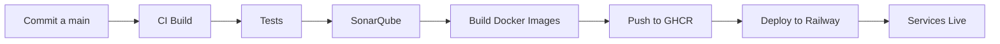

# Pipeline CI/CD - Universidad Management System

## 📋 Descripción General

Este proyecto implementa un pipeline completo de CI/CD para un sistema de gestión universitaria basado en microservicios, utilizando GitHub Actions como plataforma de automatización y **Railway** como plataforma de despliegue en la nube.

## 🏗️ Arquitectura de Microservicios

### Servicios Implementados

1. **AuthService** (Puerto 5063)
   - Autenticación y autorización con JWT
   - Gestión de usuarios y roles
   - Base de datos: PostgreSQL (Neon)

2. **WebAPI** (Puerto 5000)
   - API principal de gestión universitaria
   - CRUD de estudiantes, profesores, facultades y carreras
   - Gestión de matrículas

3. **NotificationService** (Puerto 5065)
   - Envío de notificaciones por email
   - Integración con RabbitMQ
   - SMTP configurado (Mailtrap)

4. **AuditService** (Puerto 5066)
   - Auditoría de eventos del sistema
   - Integración con Apache Kafka
   - Registro de todas las operaciones críticas

5. **Frontend** (Puerto 4200)
   - Aplicación Angular 18
   - Interfaz de usuario completa
   - Gestión de todas las entidades

### Estrategia de Repositorio

- **Tipo**: Monorepo
- **Justificación**: Facilita la coordinación entre servicios, versionado unificado y despliegues sincronizados
- **Estructura**:
  ```
  net-microservicio-ci-cd/
  ├── UniversityManagement.AuthService/
  ├── UniversityManagement.WebApi/
  ├── UniversityManagement.NotificationService/
  ├── UniversityManagement.AuditService/
  ├── UniversityManagement.Domain/
  ├── UniversityManagement.Infrastructure/
  ├── UniversityManagement.Application/
  ├── university-frontend/
  ├── UniversityManagement.AuthService.Tests/
  ├── UniversityManagement.WebApi.Tests/
  └── .github/workflows/
  ```

## 🔄 Pipeline CI/CD

### Disparadores (Triggers)

El pipeline se ejecuta automáticamente en los siguientes eventos:

1. **Push a ramas principales**:
   - `main`: Despliega a staging y producción (con aprobación)
   - `develop`: Solo ejecuta build y tests

2. **Pull Requests**:
   - Cualquier PR hacia `main`
   - Ejecuta análisis completo sin despliegue

3. **Manual**:
   - `workflow_dispatch`: Permite ejecución manual

### Etapas del Pipeline

#### 1️⃣ Build and Test .NET Services
**Duración estimada**: 2-3 minutos

**Acciones**:
- Checkout del código
- Setup de .NET 9.0
- Restauración de dependencias (`dotnet restore`)
- Compilación en Release (`dotnet build`)
- Ejecución de pruebas unitarias (`dotnet test`)
- Generación de reportes de cobertura (XPlat Code Coverage)

**Criterio de éxito**:
- Todas las pruebas deben pasar (18 pruebas actualmente)
- Cobertura mínima: No definida (se recomienda >80%)

**Artefactos generados**:
- Resultados de pruebas (formato TRX)
- Reportes de cobertura (formato Cobertura XML)

#### 2️⃣ SonarQube Analysis
**Duración estimada**: 3-5 minutos

**Acciones**:
- Setup de JDK 17 (requerido por SonarQube)
- Instalación de SonarScanner para .NET
- Descarga de reportes de cobertura
- Análisis estático del código
- Verificación de Quality Gate

**Métricas analizadas**:
- **Code Smells**: Problemas de mantenibilidad
- **Bugs**: Errores potenciales
- **Vulnerabilities**: Problemas de seguridad
- **Duplicación**: Código duplicado
- **Cobertura**: Porcentaje de código cubierto por tests
- **Complejidad ciclomática**: Complejidad del código

**Quality Gates**:
```yaml
Condiciones mínimas para aprobar:
- Coverage: >= 80%
- Duplicated Lines: < 3%
- Maintainability Rating: A
- Reliability Rating: A
- Security Rating: A
- Security Hotspots Reviewed: 100%
```

**Archivos excluidos del análisis**:
- Archivos de prueba (`**Tests**.cs`)
- Archivos de configuración (`**/Program.cs`)
- Migraciones de base de datos (`**/Migrations/**`)

**Criterio de éxito**:
- Quality Gate debe estar en estado "Passed"
- Si falla, el pipeline se detiene

#### 3️⃣ Build Frontend
**Duración estimada**: 1-2 minutos

**Acciones**:
- Setup de Node.js 20.x
- Instalación de dependencias (`npm ci`)
- Build de producción de Angular
- Optimización y minificación

**Artefactos generados**:
- Aplicación Angular compilada (`dist/`)

#### 4️⃣ Build Docker Images
**Duración estimada**: 5-8 minutos (paralelo)

**Ejecución**: Solo en push a `main`

**Imágenes construidas**:
1. `auth-service`: Servicio de autenticación
2. `webapi`: API principal
3. `notification-service`: Servicio de notificaciones
4. `audit-service`: Servicio de auditoría
5. `frontend`: Aplicación Angular

**Registro**: GitHub Container Registry (ghcr.io)

**Tags generados**:
- `latest`: Última versión de main
- `main-<sha>`: Commit específico
- `v1.0.0`: Versiones semánticas (si se usa)

**Optimizaciones**:
- Cache de capas de Docker
- Build paralelo de servicios
- Multi-stage builds para reducir tamaño

#### 5️⃣ Deploy to Staging
**Duración estimada**: 1 minuto

**Ejecución**: Automática después de build de imágenes

**Ambiente**: Staging
- URL: https://staging.universidad.com (ejemplo)

**Acciones**:
- Pull de imágenes Docker desde GHCR
- Actualización de servicios en staging

#### 6️⃣ Deploy to Production
**Duración estimada**: 1 minuto

**Ejecución**: Requiere **aprobación manual**

**Ambiente**: Production
- URL: https://universidad.com (ejemplo)

**Criterio de aprobación**:
- Revisión manual por equipo DevOps
- Verificación en staging exitosa
- Ventana de mantenimiento aprobada

## 🔐 Secrets Requeridos

Configurar en GitHub Settings > Secrets and variables > Actions:

### SonarQube
```
SONAR_TOKEN: Token de autenticación de SonarQube
SONAR_HOST_URL: URL del servidor SonarQube (ej: https://sonarcloud.io)
```

### Base de Datos
```
EXTERNAL_DB_CONNECTION_STRING: Cadena de conexión a PostgreSQL principal
AUTH_DB_CONNECTION_STRING: Cadena de conexión a base de datos de autenticación
```

### Otros
```
JWT_SECRET_KEY: Clave secreta para JWT
SMTP_PASSWORD: Contraseña del servicio SMTP
RABBITMQ_PASSWORD: Contraseña de RabbitMQ
```

## 📊 Estrategia de Versionado

### Semantic Versioning (SemVer)

Formato: `MAJOR.MINOR.PATCH`

- **MAJOR**: Cambios incompatibles en API
- **MINOR**: Nueva funcionalidad compatible
- **PATCH**: Corrección de bugs

### Branching Strategy

```
main (producción)
  ├── develop (desarrollo)
  │   ├── feature/nueva-funcionalidad
  │   ├── feature/otra-funcionalidad
  │   └── bugfix/correccion-error
  └── hotfix/fix-critico
```

### Workflow de Desarrollo

1. **Feature Development**:
   ```bash
   git checkout -b feature/nombre-feature develop
   # Desarrollo...
   git push origin feature/nombre-feature
   # Crear PR hacia develop
   ```

2. **Release**:
   ```bash
   git checkout -b release/v1.2.0 develop
   # Preparación del release...
   git checkout main
   git merge release/v1.2.0
   git tag -a v1.2.0 -m "Release version 1.2.0"
   git push origin main --tags
   ```

3. **Hotfix**:
   ```bash
   git checkout -b hotfix/fix-critico main
   # Corrección...
   git checkout main
   git merge hotfix/fix-critico
   git tag -a v1.2.1 -m "Hotfix 1.2.1"
   git push origin main --tags
   ```

## 🧪 Pruebas

### Pruebas Unitarias

**Framework**: xUnit

**Cobertura actual**:
- AuthService: 10 pruebas
- WebAPI: 8 pruebas
- Total: 18 pruebas

**Comando local**:
```bash
dotnet test --logger "console;verbosity=detailed"
```

### Pruebas de Integración

**Próximas implementaciones**:
- Tests de API con TestServer
- Tests de base de datos con contenedores
- Tests de mensajería con RabbitMQ

## 🐳 Docker

### Construcción Local

```bash
# Servicios backend
docker build -f UniversityManagement.AuthService/Dockerfile -t auth-service .
docker build -f UniversityManagement.WebApi/Dockerfile -t webapi .

# Frontend
cd university-frontend
docker build -t frontend .
```

### Ejecución Local

```bash
docker-compose up -d
```

### Registro de Imágenes

**GitHub Container Registry**:
```
ghcr.io/kamaro600/net-microservicio-ci-cd/auth-service:latest
ghcr.io/kamaro600/net-microservicio-ci-cd/webapi:latest
ghcr.io/kamaro600/net-microservicio-ci-cd/notification-service:latest
ghcr.io/kamaro600/net-microservicio-ci-cd/audit-service:latest
ghcr.io/kamaro600/net-microservicio-ci-cd/frontend:latest
```

## 📈 Métricas y Monitoreo

### Métricas del Pipeline

- **Build Success Rate**: % de builds exitosos
- **Test Pass Rate**: % de pruebas exitosas
- **Code Coverage**: Cobertura de código
- **Build Duration**: Tiempo promedio de build
- **Deployment Frequency**: Frecuencia de despliegues

### Herramientas

- **GitHub Actions**: Ejecución del pipeline
- **SonarQube/SonarCloud**: Análisis de calidad de código
- **GitHub Container Registry**: Almacenamiento de imágenes Docker

## 🚀 Deployment en Railway

### Plataforma de Despliegue

Este proyecto se despliega automáticamente en **Railway** (https://railway.app), una plataforma PaaS que soporta contenedores Docker con despliegue automático desde GitHub.

### Ambientes

- **Production**: Railway (despliegue automático desde branch `main`)

### Configuración de Railway

Ver documentación completa en: **[RAILWAY_DEPLOYMENT.md](RAILWAY_DEPLOYMENT.md)**

#### Servicios Desplegados:
1. **Auth Service**: `https://auth-service-xxx.up.railway.app`
2. **WebAPI**: `https://webapi-xxx.up.railway.app`
3. **Notification Service**: `https://notification-xxx.up.railway.app`
4. **Audit Service**: `https://audit-xxx.up.railway.app`
5. **Frontend**: `https://frontend-xxx.up.railway.app`

### Proceso de Despliegue Automático



### Secrets Requeridos en GitHub

Para habilitar el despliegue automático, configurar en **GitHub Secrets**:

```
RAILWAY_TOKEN                    # Token de autenticación de Railway
RAILWAY_AUTH_SERVICE_ID          # Service ID del Auth Service
RAILWAY_WEBAPI_SERVICE_ID        # Service ID del WebAPI
RAILWAY_NOTIFICATION_SERVICE_ID  # Service ID del Notification Service
RAILWAY_AUDIT_SERVICE_ID         # Service ID del Audit Service
RAILWAY_FRONTEND_SERVICE_ID      # Service ID del Frontend
```

### Variables de Entorno en Railway

Cada servicio en Railway debe tener configuradas sus variables de entorno:

#### Auth Service:
```env
ASPNETCORE_ENVIRONMENT=Production
ASPNETCORE_URLS=http://0.0.0.0:5063
ConnectionStrings__DefaultConnection=<NEON_POSTGRES_URL>
Jwt__Key=<JWT_SECRET_KEY>
RabbitMQ__HostName=<RAILWAY_RABBITMQ_HOST>
```

#### WebAPI:
```env
ASPNETCORE_ENVIRONMENT=Production
ASPNETCORE_URLS=http://0.0.0.0:5000
ConnectionStrings__DefaultConnection=<NEON_POSTGRES_URL>
AuthService__Url=<AUTH_SERVICE_RAILWAY_URL>
```

#### Frontend:
```env
API_URL=<WEBAPI_RAILWAY_URL>
AUTH_URL=<AUTH_SERVICE_RAILWAY_URL>
```

### Dominio Personalizado

Railway permite configurar dominios personalizados en cada servicio:

1. En Railway Dashboard → Service → Settings → Networking
2. Click en "Custom Domain"
3. Agregar dominio: `auth.tudominio.com`, `api.tudominio.com`, etc.
4. Configurar DNS con CNAME apuntando a Railway

Railway genera certificados SSL automáticamente para dominios personalizados.

### Monitoreo en Railway

Railway proporciona:
- **Logs en tiempo real** de cada servicio
- **Métricas de uso**: CPU, RAM, Network
- **Deploy history**: Historial de despliegues
- **Health checks**: Verificación automática de salud
    C --> D[SonarQube]
    D --> E{Quality Gate}
    E -->|Pass| F[Build Images]
    E -->|Fail| G[Stop]
    F --> H[Deploy Staging]
    H --> I{Manual Approval}
    I -->|Approved| J[Deploy Production]
    I -->|Rejected| K[Rollback]
```

## 📝 Checklist de Calidad

Antes de hacer merge a `main`:

- [ ] Todas las pruebas unitarias pasan
- [ ] Coverage >= 80%
- [ ] SonarQube Quality Gate: Passed
- [ ] No hay vulnerabilidades de seguridad críticas
- [ ] Documentación actualizada
- [ ] CHANGELOG actualizado
- [ ] Variables de entorno documentadas
- [ ] Imágenes Docker construidas exitosamente
- [ ] Smoke tests en staging exitosos

## 🔧 Troubleshooting

### Build Failures

**Problema**: Tests fallan
- **Solución**: Revisar logs detallados con `dotnet test --logger "console;verbosity=detailed"`

**Problema**: SonarQube Quality Gate falla
- **Solución**: Revisar el dashboard de SonarQube para métricas específicas

### Docker Issues

**Problema**: Imagen no se construye
- **Solución**: Verificar Dockerfile y context path

**Problema**: Imagen muy grande
- **Solución**: Usar multi-stage builds, optimizar capas

## 📚 Referencias

- [SonarQube Documentation](https://docs.sonarqube.org/)
- [GitHub Actions Documentation](https://docs.github.com/en/actions)
- [Docker Best Practices](https://docs.docker.com/develop/dev-best-practices/)
- [Semantic Versioning](https://semver.org/)
