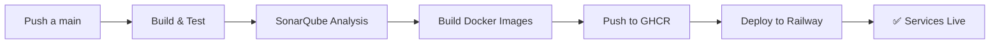

# 🚂 Guía de Despliegue en Railway

## 📋 Requisitos Previos

1. **Cuenta en Railway**: [railway.app](https://railway.app)
2. **Dominio personalizado** (opcional): Puedes usar dominios de Railway o conectar tu propio dominio
3. **GitHub conectado**: Railway se conecta directamente a tu repositorio

## 🎯 Configuración Inicial en Railway

### Paso 1: Crear Proyecto en Railway

1. Ve a [railway.app](https://railway.app) y crea una cuenta
2. Click en **"New Project"**
3. Selecciona **"Deploy from GitHub repo"**
4. Autoriza a Railway para acceder a tu repositorio
5. Selecciona el repositorio: `kamaro600/net-microservicio-ci-cd`

### Paso 2: Crear Servicios

Railway necesita **5 servicios separados**. Crea cada uno:

#### 🔐 Auth Service
```bash
# En Railway Dashboard
1. Click "+ New Service"
2. Selecciona "From GitHub Repo"
3. Nombre: auth-service
4. Build:
   - Dockerfile Path: UniversityManagement.AuthService/Dockerfile
   - Root Directory: UniversityManagement.AuthService
```

#### 🌐 WebAPI
```bash
1. Click "+ New Service"
2. Nombre: webapi
3. Build:
   - Dockerfile Path: UniversityManagement.WebApi/Dockerfile
   - Root Directory: UniversityManagement.WebApi
```

#### 📧 Notification Service
```bash
1. Click "+ New Service"
2. Nombre: notification
3. Build:
   - Dockerfile Path: UniversityManagement.NotificationService/Dockerfile
   - Root Directory: UniversityManagement.NotificationService
```

#### 📊 Audit Service
```bash
1. Click "+ New Service"
2. Nombre: audit
3. Build:
   - Dockerfile Path: UniversityManagement.AuditService/Dockerfile
   - Root Directory: UniversityManagement.AuditService
```

#### 🎨 Frontend (Angular)
```bash
1. Click "+ New Service"
2. Nombre: frontend
3. Build:
   - Dockerfile Path: university-frontend/Dockerfile
   - Root Directory: university-frontend
```

### Paso 3: Configurar Variables de Entorno

Para cada servicio, configura las variables en Railway:

#### Auth Service (puerto 5063)
```env
ASPNETCORE_ENVIRONMENT=Production
ASPNETCORE_URLS=http://0.0.0.0:5063
ConnectionStrings__DefaultConnection=<TU_NEON_POSTGRES_URL>
Jwt__Key=<TU_JWT_KEY_SEGURA>
Jwt__Issuer=UniversityManagement
Jwt__Audience=UniversityManagement
RabbitMQ__HostName=<RAILWAY_RABBITMQ_HOST>
RabbitMQ__UserName=<RAILWAY_RABBITMQ_USER>
RabbitMQ__Password=<RAILWAY_RABBITMQ_PASSWORD>
```

#### WebAPI (puerto 5000)
```env
ASPNETCORE_ENVIRONMENT=Production
ASPNETCORE_URLS=http://0.0.0.0:5000
ConnectionStrings__DefaultConnection=<TU_NEON_POSTGRES_URL>
AuthService__Url=https://<AUTH_SERVICE_RAILWAY_URL>
RabbitMQ__HostName=<RAILWAY_RABBITMQ_HOST>
RabbitMQ__UserName=<RAILWAY_RABBITMQ_USER>
RabbitMQ__Password=<RAILWAY_RABBITMQ_PASSWORD>
```

#### Notification Service (puerto 5065)
```env
ASPNETCORE_ENVIRONMENT=Production
ASPNETCORE_URLS=http://0.0.0.0:5065
RabbitMQ__HostName=<RAILWAY_RABBITMQ_HOST>
RabbitMQ__UserName=<RAILWAY_RABBITMQ_USER>
RabbitMQ__Password=<RAILWAY_RABBITMQ_PASSWORD>
```

#### Audit Service (puerto 5066)
```env
ASPNETCORE_ENVIRONMENT=Production
ASPNETCORE_URLS=http://0.0.0.0:5066
ConnectionStrings__DefaultConnection=<TU_NEON_POSTGRES_URL>
Kafka__BootstrapServers=<RAILWAY_KAFKA_BROKERS>
```

#### Frontend (puerto 80)
```env
API_URL=https://<WEBAPI_RAILWAY_URL>
AUTH_URL=https://<AUTH_SERVICE_RAILWAY_URL>
```

### Paso 4: Agregar Servicios de Infraestructura

#### PostgreSQL (ya tienes Neon, pero si quieres en Railway):
```bash
1. Click "+ New Service"
2. Selecciona "Database" → "PostgreSQL"
3. Railway genera automáticamente: DATABASE_URL
4. Copia esta URL para ConnectionStrings__DefaultConnection
```

#### RabbitMQ
```bash
1. Click "+ New Service"
2. Busca "RabbitMQ" en templates
3. Railway genera variables automáticamente
```

#### Kafka (CloudKarafka o Upstash)
```bash
# Railway no tiene Kafka nativo, usa servicio externo:
1. Upstash Kafka (gratis): https://upstash.com
2. O CloudKarafka: https://www.cloudkarafka.com
3. Copia los bootstrap servers a las variables
```

## 🔧 Configuración de GitHub Actions

### Obtener Railway Token

1. En Railway Dashboard → **Settings** → **Tokens**
2. Click **"Create Token"**
3. Copia el token generado

### Obtener Service IDs

Para cada servicio en Railway:
1. Abre el servicio
2. Ve a **Settings** → **General**
3. Copia el **Service ID** (formato: `xxxxxxxx-xxxx-xxxx-xxxx-xxxxxxxxxxxx`)

### Agregar Secrets a GitHub

Ve a tu repositorio en GitHub:
`Settings` → `Secrets and variables` → `Actions` → `New repository secret`

Agrega estos secrets:

```yaml
RAILWAY_TOKEN=<tu_token_de_railway>
RAILWAY_AUTH_SERVICE_ID=<service_id_auth>
RAILWAY_WEBAPI_SERVICE_ID=<service_id_webapi>
RAILWAY_NOTIFICATION_SERVICE_ID=<service_id_notification>
RAILWAY_AUDIT_SERVICE_ID=<service_id_audit>
RAILWAY_FRONTEND_SERVICE_ID=<service_id_frontend>
```

## 🌐 Configurar Dominio Personalizado

### En cada servicio de Railway:

1. Ve a **Settings** → **Networking** → **Public Networking**
2. Click **"Generate Domain"** (Railway te da un dominio gratis: `xxx.up.railway.app`)
3. O click **"Custom Domain"** para usar tu propio dominio:
   ```
   auth.tudominio.com → Auth Service
   api.tudominio.com → WebAPI
   app.tudominio.com → Frontend
   ```

### Configuración DNS (si usas dominio propio):

En tu proveedor de DNS (Cloudflare, GoDaddy, etc.):

```dns
# Tipo   Nombre   Valor                           TTL
CNAME    auth     auth-service.up.railway.app     Auto
CNAME    api      webapi.up.railway.app          Auto
CNAME    app      frontend.up.railway.app        Auto
```

Railway genera certificados SSL automáticamente.

## 🚀 Despliegue Automático

### Trigger de Despliegue

El pipeline de GitHub Actions desplegará automáticamente cuando:

```yaml
# Evento: Push a rama main
git add .
git commit -m "feat: update service"
git push origin main
```

### Flujo del Pipeline



### Verificación del Despliegue

1. **GitHub Actions**: Ve a la pestaña `Actions` para ver el progreso
2. **Railway Logs**: En cada servicio → `Deployments` → Click en el deploy → Ver logs
3. **Health Checks**: Verifica endpoints:
   ```bash
   curl https://auth.tudominio.com/api/auth/health
   curl https://api.tudominio.com/api/health
   ```

## 📊 Monitoreo en Railway

Railway Dashboard muestra:

- **CPU Usage**: Uso de procesador por servicio
- **Memory**: Consumo de RAM
- **Network**: Tráfico entrante/saliente
- **Logs**: Logs en tiempo real
- **Metrics**: Gráficas de rendimiento

## 💰 Costos y Límites

### Plan Gratuito de Railway (Starter):
- **$5 USD de crédito mensual gratis**
- Aproximadamente **500 horas de ejecución**
- Suficiente para:
  - 1-2 servicios corriendo 24/7
  - O 5 servicios con tráfico bajo (duermen sin uso)

### Optimización de Costos:
```yaml
# En railway.json para cada servicio:
{
  "deploy": {
    "sleepAfterInactivity": 300  # Duerme después de 5 min sin tráfico
  }
}
```

### Si se acaba el crédito:
- Servicios se pausan automáticamente
- Actualiza a **Hobby Plan** ($5/mes + uso)
- O usa **Developer Plan** ($20/mes incluye $20 crédito)

## 🔍 Troubleshooting

### Servicio no inicia:
```bash
# Verifica logs en Railway
1. Dashboard → Service → Deployments → View Logs
2. Busca errores de conexión de base de datos
3. Verifica variables de entorno
```

### Error de puerto:
```bash
# Railway asigna el puerto automáticamente
# Asegúrate de usar: 0.0.0.0:$PORT o el puerto específico
ASPNETCORE_URLS=http://0.0.0.0:5000
```

### Frontend no carga:
```bash
# Verifica que env.sh se ejecute en el contenedor
# En railway.json del frontend:
{
  "build": {
    "builder": "DOCKERFILE"
  },
  "deploy": {
    "startCommand": "sh /usr/share/nginx/html/env.sh && nginx -g 'daemon off;'"
  }
}
```

## 📝 Checklist de Despliegue

- [ ] Cuenta Railway creada
- [ ] 5 servicios creados en Railway
- [ ] Variables de entorno configuradas
- [ ] PostgreSQL configurado (Neon o Railway)
- [ ] RabbitMQ agregado
- [ ] Kafka configurado (Upstash)
- [ ] Railway Token generado
- [ ] Service IDs copiados
- [ ] Secrets agregados a GitHub
- [ ] Dominio personalizado configurado (opcional)
- [ ] DNS configurado (si usas dominio propio)
- [ ] Push a main realizado
- [ ] Pipeline ejecutado exitosamente
- [ ] Servicios verificados en Railway

## 🎉 ¡Listo!

Tu aplicación estará disponible en:
- **Frontend**: `https://app.tudominio.com` o `https://frontend-xxx.up.railway.app`
- **API**: `https://api.tudominio.com` o `https://webapi-xxx.up.railway.app`
- **Auth**: `https://auth.tudominio.com` o `https://auth-xxx.up.railway.app`

Cada push a `main` desplegará automáticamente las actualizaciones. 🚀
