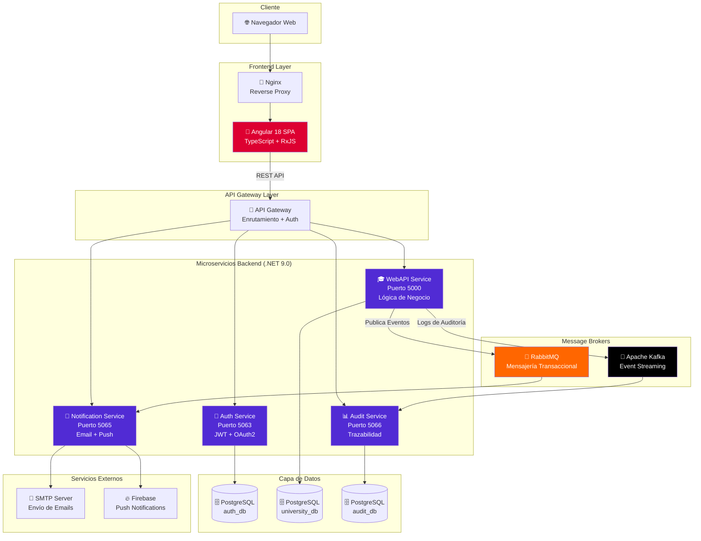
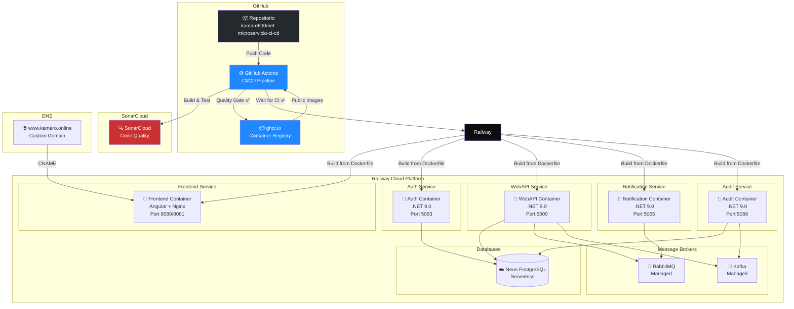
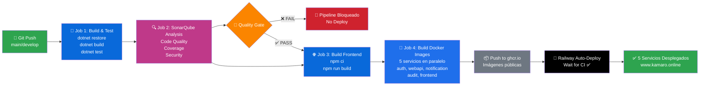
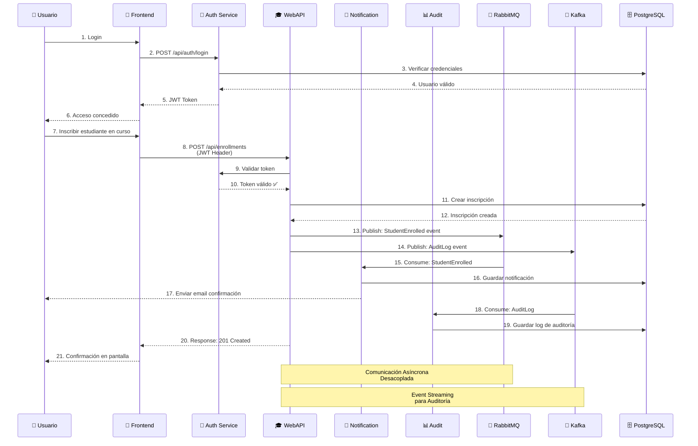
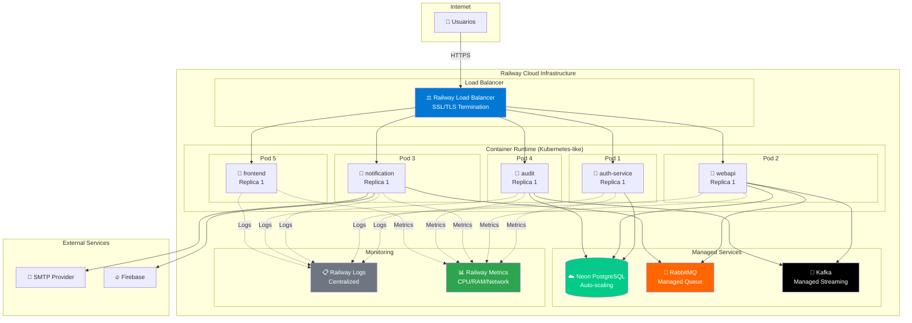
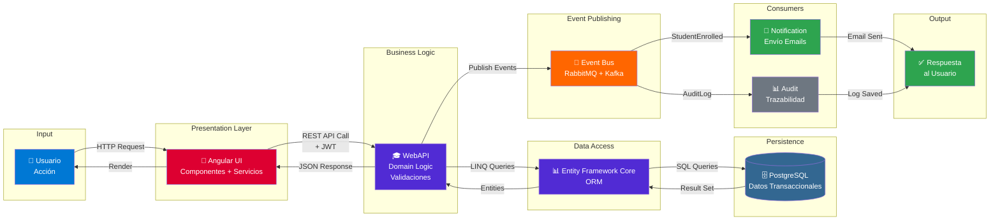
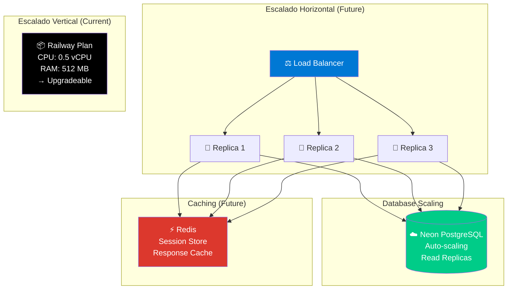

# Diagramas de Arquitectura
# Sistema de Gestión Universitaria

**Fecha:** Diciembre 2025

---

## 📐 Índice de Diagramas

1. [Diagrama de Arquitectura General](#1-diagrama-de-arquitectura-general)
2. [Diagrama de Despliegue (Deployment)](#2-diagrama-de-despliegue-deployment)
3. [Diagrama de Pipeline CI/CD](#3-diagrama-de-pipeline-cicd)
4. [Diagrama de Comunicación entre Microservicios](#4-diagrama-de-comunicación-entre-microservicios)
5. [Diagrama de Infraestructura Cloud](#5-diagrama-de-infraestructura-cloud)
6. [Diagrama de Flujo de Datos](#6-diagrama-de-flujo-de-datos)

---

## 1. Diagrama de Arquitectura General

**Descripción:**
- **Frontend**: Angular SPA servida por Nginx
- **Backend**: 4 microservicios .NET independientes
- **Datos**: PostgreSQL separado por servicio (Database per Service)
- **Mensajería**: RabbitMQ para eventos transaccionales, Kafka para auditoría
- **Integración**: API Gateway para enrutamiento centralizado

---

## 2. Diagrama de Despliegue (Deployment)

**Descripción:**
- **Código Fuente**: GitHub repository
- **CI/CD**: GitHub Actions con Quality Gate de SonarCloud
- **Registry**: ghcr.io para imágenes públicas (opcional)
- **Hosting**: Railway con 5 contenedores independientes
- **Base de Datos**: Neon PostgreSQL (managed)
- **Dominio**: www.kamaro.online con SSL automático

---

## 3. Diagrama de Pipeline CI/CD

**Etapas del Pipeline:**

1. **Build & Test**: Compilación y tests unitarios de .NET
2. **SonarQube**: Análisis de calidad (Coverage, Bugs, Vulnerabilities)
3. **Quality Gate**: Checkpoint que bloquea si no cumple estándares
4. **Build Frontend**: Compilación de Angular en modo producción
5. **Docker Build**: Construcción de 5 imágenes Docker en paralelo
6. **Publish**: Subida de imágenes a ghcr.io
7. **Railway Deploy**: Despliegue automático a Railway

**Tiempo Estimado Total:** ~12-15 minutos

---

## 4. Diagrama de Comunicación entre Microservicios

**Flujo de Comunicación:**

- **Sincrónica (REST)**: Frontend ↔ Servicios (HTTP/HTTPS)
- **Asincrónica (Eventos)**: Servicios ↔ RabbitMQ/Kafka
- **Autenticación**: JWT validado en cada request
- **Desacoplamiento**: Servicios no se conocen entre sí, solo eventos

---

## 5. Diagrama de Infraestructura Cloud

**Componentes de Infraestructura:**

- **Load Balancer**: Railway gestiona SSL/TLS y enrutamiento
- **Container Runtime**: Similar a Kubernetes, orquestación automática
- **Managed DB**: Neon PostgreSQL con auto-scaling
- **Message Brokers**: RabbitMQ y Kafka gestionados
- **Observability**: Logs centralizados y métricas de infraestructura

---

## 6. Diagrama de Flujo de Datos

**Capas de la Arquitectura:**

1. **Presentation**: Angular (TypeScript, RxJS, Angular Material)
2. **Business Logic**: WebAPI (.NET 9.0, Domain-Driven Design)
3. **Data Access**: Entity Framework Core (ORM)
4. **Persistence**: PostgreSQL (Relacional)
5. **Event-Driven**: RabbitMQ + Kafka (Mensajería)
6. **Cross-Cutting**: Notification + Audit (Microservicios auxiliares)

---

## 📊 Resumen de Tecnologías por Componente

| Componente | Tecnología | Puerto | Base de Datos |
|------------|------------|--------|---------------|
| **Frontend** | Angular 18 + Nginx | 8080/8081 | - |
| **Auth Service** | .NET 9.0 + JWT | 5063 | PostgreSQL (auth_db) |
| **WebAPI Service** | .NET 9.0 + EF Core | 5000 | PostgreSQL (university_db) |
| **Notification Service** | .NET 9.0 | 5065 | - |
| **Audit Service** | .NET 9.0 | 5066 | PostgreSQL (audit_db) |
| **RabbitMQ** | Managed | 5672 | - |
| **Kafka** | Managed | 9092 | - |

---

## 🔐 Seguridad en la Arquitectura

**Capas de Seguridad Implementadas:**

- ✅ HTTPS obligatorio con certificados SSL automáticos
- ✅ JWT para autenticación stateless
- ✅ RBAC para autorización basada en roles
- ✅ Contenedores ejecutando como usuarios no privilegiados
- ✅ Secrets gestionados por Railway (no en código)
- ✅ Validación de entrada en todos los endpoints
- ✅ Cifrado de datos en tránsito y reposo

---

## 📈 Escalabilidad y Alta Disponibilidad

**Estrategia de Escalabilidad:**

- **Fase 1 (Actual)**: Railway plan gratuito, 1 réplica por servicio
- **Fase 2 (Crecimiento)**: Escalado vertical (más CPU/RAM)
- **Fase 3 (Producción)**: Escalado horizontal (múltiples réplicas)
- **Fase 4 (Enterprise)**: Redis cache + CDN + Multi-región

---

## 🎯 Referencias

- **Repositorio GitHub**: https://github.com/kamaro600/net-microservicio-ci-cd
- **SonarCloud**: https://sonarcloud.io/dashboard?id=kamaro600_net-microservicio-ci-cd
- **Sitio Web**: https://www.kamaro.online
- **Documentación ADR**: [ADR.md](ADR.md)
- **Documentación CI/CD**: [CI-CD-README.md](../CI-CD-README.md)

---

**Última actualización:** Diciembre 2025
**Autor:** Equipo de Desarrollo
**Versión:** 1.0
